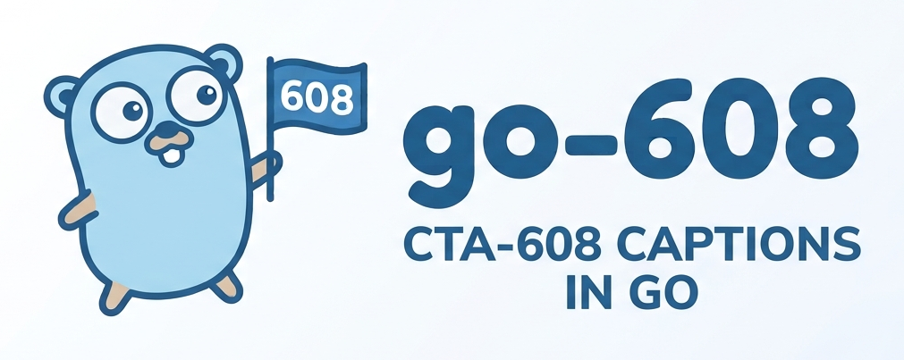

<p align="center">
  
</p>

[](https://github.com/Eyevinn/go-608/actions/workflows/go.yml)
[](https://coveralls.io/github/Eyevinn/go-608?branch=main)
[](https://github.com/Eyevinn/go-608/actions/workflows/golangci-lint.yml)
[](https://pkg.go.dev/github.com/Eyevinn/go-608)
[](https://github.com/Eyevinn/go-608/blob/main/LICENSE)

A pure-Go library for **CTA-608 / CEA-608** captions: encode + decode,
`cc_data` + SEI carriage per ATSC A/53 (AVC & HEVC), wall-clock caption
generation, and timed-text (SCC / WebVTT / SRT) I/O.

The full design lives in [`SPEC.md`](SPEC.md), with per-decision rationale in
[`docs/design/`](docs/design/).

## Why "608" and "cta608"

The modern standard is **CTA-608** (the org renamed from CEA to CTA), so the
core package is `cta608`. The legacy "CEA-608" spelling persists in prior art
and in the `mp4ff` dependency's API (`ParseCEA608`, `IsCEA608`); that spelling
is confined to the `carriage` package that wraps mp4ff.

## Packages

go-608 is a set of cooperating packages. The module has **no importable root
package** (the last path element `go-608` is not a valid Go identifier); import
the packages directly.

| Package    | Responsibility                                                        |
|------------|----------------------------------------------------------------------|
| `cta608`   | Pure core: Token stream, `Screen`, `Serialize`/`Parse`, `Decoder`/`Encoder`, `CaptionBlock`. A dependency-free leaf. |
| `carriage` | `cc_data` / T.35 / SEI / NAL carriage for AVC & HEVC. The only mp4ff importer. |
| `schedule` | Timed tokens → per-frame `{Field1, Field2, CCCount}`. The shared timing layer. |
| `generate` | Wall-clock caption `Generator` (the first milestone).                |
| `scc`      | Scenarist SCC read/write — byte-exact, true SMPTE drop-frame.        |
| `cue`      | Shared `TimedCue` intermediate + the 608↔cue mapping + a plugin seam. |
| `webvtt`   | WebVTT serializer over the `cue` model.                              |
| `srt`      | SRT serializer over the `cue` model.                                 |

### Dependency layering

```
cta608 (pure, leaf) ─┬─ scc
                     ├─ cue ─┬─ webvtt
                     │       └─ srt
                     ├─ carriage (+ mp4ff)   ← the only mp4ff importer
                     └─ schedule ── generate
cmd/ (go608-extract|inject|clock|info) wire the above; internal/ holds version + cmd glue.
```

## The `cta608` wire boundary

The core spine is a **wire-faithful token stream**. `Serialize` turns tokens
into odd-parity `cc_data` byte pairs and `Parse` turns them back, so a `[]Token`
round-trips bytes exactly.

The token sum type (closed under the `Token` interface):

| Token            | Meaning                                                       |
|------------------|---------------------------------------------------------------|
| `Chars`          | a run of characters (standard, special, and extended glyphs)  |
| `PAC`            | Preamble Address Code: row + base pen, or row + indent        |
| `MidRow`         | mid-row style change (color/underline/italics)                |
| `TabOffset`      | shift the cursor 1–3 columns                                  |
| `BackgroundAttr` | background color / transparent bg / black-foreground          |
| `SetMode`        | pop-on (RCL), roll-up (RU2/3/4), or paint-on (RDC)            |
| `Command`        | misc control: EOC, EDM, ENM, CR, BS, DER, TR, RTD, FON, …     |

`Serialize`/`Parse` own **all** byte concerns so the token model stays logical:
odd parity, control-code **doubling** (on for field 1, off for field 2 by
default, overridable), two-characters-per-pair packing, null-pair **frame
alignment** of two-byte control codes, and extended-character
**backspace-and-replace**. `ParseOptions` chooses validate-vs-strip parity;
`SerializeOptions` selects the field, channel, and doubling policy.

```go
tokens := []cta608.Token{
    cta608.SetMode{Mode: cta608.PopOn},
    cta608.PAC{Row: 15, Indent: cta608.NoIndent, Pen: cta608.Pen{Color: cta608.White}},
    cta608.Chars{Text: "HELLO"},
    cta608.Command{Op: cta608.EOC},
}
data := cta608.Serialize(tokens, cta608.SerializeOptions{}) // field 1, doubling on
back, _ := cta608.Parse(data, cta608.ParseOptions{})        // back == tokens
```

`DemuxField`/`MuxField` split and join the two in-field data channels by the
control byte's high nibble. `Screen`/`Row`/`Run`/`Pen` are the sparse, derived
display value types (`Pen` is a comparable value). A runnable round-trip lives
in [`examples/`](examples/). The stateful `Decoder` (tokens → `Screen`) lands in
a later ticket.

## Encoding: the `Encoder` and `CaptionBlock`

`Encoder` is the single per-channel **diff engine** (SPEC §2). It holds the
currently displayed `Screen` and turns a *target* `Screen` into the `[]Token`
that transforms one into the other. All mode-specific token generation lives in
one place:

- **pop-on** — build into non-displayed memory and flip with `EOC` (`RCL`, `ENM`,
  the rows, `EOC`); an unchanged target emits nothing, clearing emits `EDM`.
- **roll-up** — enter with `RU2/3/4`, append to the base row (a minimal delta:
  extending the bottom line emits only the new characters), and scroll with `CR`.
- **paint-on** — enter with `RDC` and write changed rows directly to the display.

The diff bottoms out at the **character-run within a row**, so incremental
changes stay small. The zero value is a valid pop-on `Encoder`; `SetMode`
switches modes.

`CaptionBlock` is friendly authoring on top of `Screen`: `Lines` placed by an
`Anchor` (top/bottom) with a per-line `Align` (left/center/right). `Screen()`
compiles it to a target `Screen`, and the `Encoder` lowers each run's **absolute
column** to a PAC indent + Tab Offset — compensating one column for the mid-row
cell of a centered **colored** line (SPEC §7), so `PAC(indent, white)` → `Tab` →
`MidRow(color)` lands the text on its intended column.

```go
block := cta608.CaptionBlock{
    Mode:   cta608.PopOn,
    Anchor: cta608.AnchorBottom,
    Lines: []cta608.Line{
        {Align: cta608.AlignCenter, Runs: []cta608.Run{{Text: "HELLO", Pen: cta608.Pen{Color: cta608.White}}}},
        {Align: cta608.AlignCenter, Runs: []cta608.Run{{Text: "WORLD", Pen: cta608.Pen{Color: cta608.Yellow}}}},
    },
}
var enc cta608.Encoder            // zero value: pop-on, empty display
tokens := enc.Apply(block)        // target Screen -> RCL/ENM … EOC token stream
data := cta608.Serialize(tokens, cta608.SerializeOptions{}) // to cc_data byte pairs
```

Power users skip `CaptionBlock` and hand `Encoder.SetScreen` a `Screen` they
build directly. A runnable authoring snippet lives in [`examples/`](examples/).

## Decoding: the `Decoder`

`Decoder` is the inverse of `Encoder` — the stateful, per-channel interpreter that
turns a token or byte stream into the displayed `Screen`. `Feed` parses `cc_data`
byte pairs and interprets them; `Push` interprets an already-parsed `[]Token`;
`Screen()` returns the displayed rows.

```go
var dec cta608.Decoder                 // zero value: pop-on, empty display
if err := dec.Feed(data); err != nil { // data == cc_data byte pairs (one channel)
    // handle parity error
}
screen := dec.Screen()                 // the sparse rendered rows
```

It models 608's double buffer with an internal displayed / non-displayed grid
(**pop-on** writes to non-displayed and `EOC` promotes it; `EDM` clears the
display), scrolls the **roll-up** window on `CR`, and writes **paint-on** rows
straight to the display. `Changed()` reports whether the displayed `Screen`
changed since the previous call — the signal WebVTT/SRT cue segmentation pivots
on. **XDS** is dropped by `Parse` and **text mode** (`TR`/`RTD`) is recognized but
not rendered (SPEC §1.3). A runnable decode snippet lives in
[`examples/`](examples/).

## Carriage (`cc_data` / SEI)

The `carriage` package is the only mp4ff importer and the seam between 608 byte
pairs and the elementary stream. It is pure and timing-free — the caller supplies
`ccCount` (from `schedule`); carriage never imports the `cta608` core.

**Encode** — build one frame's SEI NAL unit from the per-field byte pairs:

```go
// field1/field2 are each 0 or 2 bytes; ccCount comes from the frame rate (SPEC §5.3).
nalu := carriage.FrameSEINALU(field1, field2, ccCount, carriage.CodecAVC)
// nalu is a BARE NAL unit — the consumer prepends the 4-byte length and splices
// it before the first VCL NALU (into a per-emission copy, before CENC).
```

`FrameSEINALU` is `BuildCCData` (assemble the `cc_data()` per CTA-708-E §4.3: 608
constructs first, then DTVCC padding to `ccCount`) → `SEIMessage` (wrap as a
`user_data_registered_itu_t_t35` / GA94 SEI message) → `NALU` (serialize via mp4ff
and prepend the codec NAL header — AVC `0x06` or HEVC prefix-SEI 39). The three
"nothing here" encodings — an empty field pair, DTVCC padding, and the `0x80 0x80`
608 null pair — are kept distinct.

`SEIMessage` returns an mp4ff `sei.SEIMessage` and takes **no codec** — the payload
is codec-identical for AVC and HEVC. Use `NALU` to place the 608 message in one NAL
unit **together with other SEI messages** (e.g. `pic_timing`); the codec is only
needed there, for the NAL header:

```go
msg := carriage.SEIMessage(carriage.BuildCCData(field1, field2, ccCount))
nalu := carriage.NALU(carriage.CodecAVC, msg, otherSEIMessage) // one NAL, N messages
```

**Decode** — recover the field byte-pair streams from a sample's NAL units:

```go
field1, field2, err := carriage.FieldPairs(sampleNALUs, carriage.CodecAVC)
```

`FieldPairs` wraps mp4ff's `sei.ParseCEA608`; the recovered pairs feed the `cta608`
core `Decoder`. See `examples/` for a runnable round-trip and `testdata/` for a
fragmented-mp4 fixture.

## Scheduling (timed tokens → frames)

The `schedule` package is the shared timing layer between the logical token
stream and the per-frame carriage payload. It is format-agnostic and
carriage-free — it imports only `cta608` — so both the wall-clock `generate`r and
the subtitle-compile path drive the same scheduler.

A `Scheduler` holds a FIFO byte-pair queue per NTSC field. `Push` serializes a
wall-time-tagged batch of token transitions with `cta608.Serialize` and enqueues
the resulting 2-byte pairs; `Frame(frameWallMS)` drains **at most one pair per
field per frame** and reports the frame's `cc_count`, returning the primitive
`{Field1, Field2, CCCount}` triple `carriage` consumes.

```go
s := schedule.NewScheduler(30) // 30 fps → cc_count 20
s.Push(schedule.TimedTokens{TimeMS: 0, Tokens: tokens})

f := s.Frame(frameWallMS)      // ≤1 pair/field, padded to CCCount
nalu := carriage.FrameSEINALU(f.Field1, f.Field2, f.CCCount, carriage.CodecAVC)
```

- **`cc_count` per frame rate** (CTA-708-E §4.3.6, `round(600/fps)`): 23.976/24→25,
  25→24, 29.97/30→20, 50→12, 59.94/60→10. `CCCountFull` (the default) emits that
  full count and lets `carriage` pad the surplus with DTVCC padding;
  `CCCountMinimal` emits just the two 608 field constructs.
- **608 rate cap:** at ≤30 fps a frame carries one field-1 **and** one field-2
  pair; above 30 fps only **one** 608 pair per frame (field 1 first).
- **Frame alignment:** `Serialize` emits whole 2-byte pairs and `Frame` drains
  whole pairs, so a two-byte control code never straddles a frame. An idle field
  yields a 0-byte pair (distinct from the `0x80 0x80` 608 null pair and from
  DTVCC padding).

> `Push` takes `schedule.TimedTokens` (a wall-clock `TimeMS` plus a `Field`
> selector), not `cue.TimedTokens` — depending on `cue` would break the layering
> rule (`schedule` imports only `cta608`). See the package godoc.

A runnable `schedule` → `carriage` → decode round-trip lives in [`examples/`](examples/).

## Wall-clock generation (first milestone)

`generate.Generator` produces a wall-clock caption, driven **one call per video
frame** with that frame's wall-clock time. The pull-by-wall-time model makes it
robust to gaps, seeks, and variable frame rate, and makes drop-frame a non-issue.

```go
g := generate.NewGenerator(30.0, generate.DefaultConfig()) // row14 UTC (white), row15 media (yellow)
for each video frame at wall-clock ms `w` {
    f := g.NextFrame(w)                                     // schedule.Frame{Field1, Field2, CCCount}
    nalu := carriage.FrameSEINALU(f.Field1, f.Field2, f.CCCount, carriage.CodecAVC)
    // consumer prepends the 4-byte length and splices `nalu` before the first VCL NALU
}
```

It builds each upcoming second's caption through the core (`CaptionBlock` →
`Encoder` → tokens) and drives a `schedule.Scheduler`. The caption is **pop-on**:
built into non-displayed memory during a second and flipped on with a single
`EOC` on that second's **last frame**, so the clock is frame-accurate and
zero-lag (the flip pair is scheduled eligible at the flip time). Cadence is one
field-1 pair per frame (CC1 only by default); `Config`/`LineSpec` set the rows,
colors, and content kinds. An **overrun guard** (`Overran()`) flags a line set
that can't finish building within the one-second budget at the given frame rate.
A runnable N-second snippet lives in [`examples/`](examples/).

## Per-unit cues (`BuildUnitCues`)

`generate.BuildUnitCues` is the segment-oriented counterpart to `Generator`: **one call
per unit** — a DASH segment, a MoQ group — instead of one call per frame, which is what a
stateless server generating segments on demand needs. It splits the unit into
`N = NumCues(unitDurMS, targetPeriodMS)` equal cue slices, asks a `CueContentFunc` for each
slice's lines, and returns one `schedule.Frame` per video frame.

```go
frames, err := generate.BuildUnitCues(fps, unitFrames, unitStartMS, 1000, content)
```

A pop-on cue is two transmissions — a **build** (RCL + ENM + rows) written into
non-displayed memory, and an **EOC** that flips it on screen — and both drain at one 608
pair per frame. Where the build sits therefore decides *when* the caption appears, and
that is a genuine trade-off:

**Default: self-contained units.** The build starts at its cue's first frame and the flip
follows it, so every build and flip stays inside the unit and each unit is independently
decodable. The cost is arming latency: a two-line build is ~15-19 pairs, so the caption
reaches the screen 0.5-0.75 s into the ~1 s slice at 30 fps, and is visible only for the
remainder. Fine when the text is unrelated to its own display time.

**`WithFlipAtCueStart(next)`: flips on the cue boundary.** Each EOC moves onto the first
frame of its own cue and the build is transmitted over the frames *before* the flip, so
the caption is displayed over exactly the interval its content names. Use it when the text
refers to its own display interval — a clock, a segment or group number — since with the
default placement such a caption is always seen late.

```go
frames, err := generate.BuildUnitCues(fps, unitFrames, unitStartMS, 1000, content,
    generate.WithFlipAtCueStart(nextContent))
```

The build for a cue then lives in the frames preceding its flip, which for a unit's first
cue means the **previous unit**. `next` supplies the following unit's first cue so this
unit's tail can carry its build; it is called once as `next(0, unitStartMS+unitDurMS)`, and
`nil` leaves the tail empty. Consecutive units are still generated independently — a unit's
first cue is always encoded from a clean encoder state, so the build one unit places in its
tail matches the flip the next unit emits. On the wire, at 30 fps with ~1 s cues:

```text
unit A frame 45: 94 20   RCL   ─┐ build of unit B's first cue
unit A frame 46: 94 ae   ENM    │ (one pair per frame)
       ...                      │
unit A frame 59: 34 b3         ─┘ ends on A's last frame
unit B frame  0: 94 2f   EOC      the flip, on the cue boundary
```

**What this costs at a discontinuity.** Units are no longer self-contained, so a receiver
that starts, seeks, or joins mid-stream gets that leading EOC without the build that
belongs to it. What it then shows depends on its decoder state: a fresh decoder has empty
non-displayed memory and shows **nothing** for one cue period, while a decoder that keeps
608 state across the discontinuity flips whatever was last preloaded and can show **one cue
period of stale caption** before correcting at the next boundary. Recovering faster is the
receiver's job: a player that resets its 608 state at a discontinuity, as it would any
other decoder, turns the stale case into the blank one. A sender cannot help — any pair
emitted ahead of the EOC to sanitise the state (an `ENM`) would erase the very build about
to be flipped. Choose the default placement if that matters more than display accuracy.

Either way the 608 data rate is one pair per frame, so `cc_count` stays `round(600/fps)`,
and a build that does not fit the frames available to it is a returned error rather than a
silently dropped build (which would leave an EOC with nothing loaded).

## Timed-text cues (the `cue` package)

The `cue` package is the shared timed-text intermediate and the **one place** the
608↔cue mapping is written. WebVTT and SRT (and future formats like TTML) are
thin serializers over it. A `TimedCue{Start, End, Content}` reuses the core
`cta608.Screen` as its `Content`, so every format pivots on positioned, styled
rows. The mapping is **lossy and Screen-mediated** — a sibling of the byte-exact
SCC/SEI containers — because a format's richer grid and palette are quantized to
608's 15×32 grid and 8 colors at the serializer edge.

**608 → text — `Segment`.** A timeline of displayed-`Screen` states
(`TimedScreen`, sampled whenever `Decoder.Changed` fires) is cut into cues by one
unified rule for every caption mode: each displayed-`Screen` change closes the
current cue and opens a new one; an empty screen is a **gap** (no cue). Pop-on
gives one cue per caption, roll-up **one cue per scroll step** (the visible lines
repeat as the window scrolls), paint-on a cue per in-place change. A caption
still shown when the stream ends takes a configurable end — `SegmentOptions.StreamEnd`
when set, else `Start + DefaultDur`.

**text → 608 — `Compile`.** Every cue compiles to a **pop-on** caption.
Overlapping cues are **merged by position** at each boundary: the target `Screen`
is the union of all active cues' `Screen`s, placed by row, with a same-row
conflict resolved by cue order (the **later** cue wins that row). That target
drives the core `Encoder`, whose diff engine re-flips the caption whenever the
active set changes. `Compile` stops at wall-time-tagged token transitions
(`TimedTokens`); mapping them onto frames is `schedule`'s job.

```go
// 608 -> text
cues := cue.Segment(screens, cue.SegmentOptions{DefaultDur: 2 * time.Second})

// text -> 608
for _, tt := range cue.Compile(cues) { /* tt.Time, tt.Tokens -> schedule */ }
```

The `Reader`/`Writer` interface over `[]TimedCue` is the **published plugin
seam**: `webvtt` and `srt` implement it in-tree, and TTML or third-party formats
plug in with zero change to the mapping. Runnable snippets for both directions
live in [`examples/`](examples/).

## SRT (SubRip text)

The `srt` package is a thin, two-way serializer over the `cue` model — the simpler
sibling of `webvtt`. SRT is a header-less list of numbered blocks (an index line, a
`HH:MM:SS,mmm --> HH:MM:SS,mmm` timing line, and one or more text lines, blank-line
separated) with light inline styling and **no** standard positioning. All 608↔cue
logic lives in `cue`, so `srt` only maps SRT text ⇄ `[]cue.TimedCue`; it imports
only `cue`/`cta608` and the standard library.

```go
cues, _ := srt.Read(r)   // parse .srt -> cues (implements cue.Reader)
srt.Write(w, cues)       // cues -> .srt   (implements cue.Writer)
```

- **Styling**, quantized to 608's 8 colors (design note W5). Out: foreground color →
  `<font color="#rrggbb">`, italic → `<i>`, underline → `<u>`; **background is
  dropped** (SRT has none) and **bold is never emitted** (it has no 608 source). In:
  a `<font>` color (hex or a CSS keyword) → the **nearest of the 8** 608 colors,
  `<i>`/`<u>` honored, **`<b>` dropped**, and unknown tags stripped.
- **Positioning:** SRT has none, so 608→SRT renders **bottom-centered** (row/column
  placement dropped) and SRT→608 anchors text to the **bottom-center** of the grid.
  No `{\anX}` or coordinate extensions are invented — SRT stays at its portable
  common denominator (design note W6).
- **Round-trip** is **semantic, not byte-exact**: colors snap to the palette and
  placement collapses to bottom-center, but a read → write → read cycle is stable.

A runnable `.srt` ↔ cues snippet lives in [`examples/`](examples/), and sample files
in [`testdata/srt/`](testdata/srt/).

## WebVTT (`webvtt`)

The `webvtt` package is a **thin serializer over `cue`** — the richer sibling of
`srt`. It owns only WebVTT syntax and its styling/positioning quantization; every
608↔cue decision lives in `cue`, so `webvtt` imports only `cue`/`cta608` and the
standard library. Because it maps a rich format onto 608's coarse grid and 8-color
palette, `Read → Write` is a **semantic, quantized round-trip, not byte-exact**
(the lossy sibling of the SCC/SEI containers).

```go
cues, _ := webvtt.Read(r)  // WEBVTT text -> []cue.TimedCue (implements cue.Reader)
webvtt.Write(w, cues)      // []cue.TimedCue -> WEBVTT text (implements cue.Writer)
```

- **Structure:** the `WEBVTT` magic header, optional `STYLE`/`NOTE` blocks, and
  cue blocks with `HH:MM:SS.mmm --> HH:MM:SS.mmm` timing (the `.`-millisecond form),
  optional `line:`/`position:`/`align:` settings, and styled payload text. One cue
  block maps to one `TimedCue` whose `Content` is a `Screen`: each payload line is a
  `Row`, each maximal same-style span a `Run`.
- **Styling** (design note W5). *Out:* a non-white foreground becomes a `<c.name>`
  class plus a `STYLE` rule (`::cue(.red) { color: #ff0000; }`), italic/underline
  become `<i>`/`<u>`, and a background is best-effort via a `bg_name` class and a
  `::cue` background rule. *In:* any class/STYLE/`#hex`/`rgb()` color quantizes to
  the **nearest of the 8** 608 colors, `<i>`/`<u>` are honored, **bold (`<b>`) is
  dropped**, and voice/lang/unknown tags are stripped.
- **Positioning** (design note W6). `line:` ⇄ `Row.Index` (1–15) and
  `position:`/`align:` ⇄ the leftmost `Run.Column`/indent, quantized to the grid so
  the round-trip is **approximate**. A position-less cue anchors **bottom-center**.

Sample fixtures live in [`testdata/webvtt/`](testdata/webvtt/) and runnable
`.vtt` ↔ cue snippets in [`examples/`](examples/).

## SCC (Scenarist SCC read/write)

The `scc` package is a **byte-pair container** — a sibling of the SEI carriage. It
owns the SCC text-file structure and timecodes only; the `cta608` core owns all
608 semantics, so **Read → Write is byte-exact**. It imports only `cta608` and the
standard library.

```go
f, _ := scc.Read(r)                 // infers FPS/DropFrame; WithFPS(…) overrides
for _, p := range f.TimedPairs() {  // pair i of an entry lands at Frame+i
    // p.Frame, p.Pair (2 bytes) — feed the concatenated channel bytes to cta608.Parse
}
scc.Write(w, f)                     // dumb: one Entry -> one line, verbatim
```

- **Model:** `SCCFile{FPS, DropFrame, Entries}` with `Entry{Frame, Pairs}` — an
  absolute frame number plus its verbatim raw byte pairs. Canonical time is an
  absolute integer frame counted from `00:00:00:00`.
- **True SMPTE drop-frame** (`FrameToTimecode`/`TimecodeToFrame`): for 29.97/59.94
  the frame labels 0,1 (0..3 at 59.94) are skipped at the top of every minute
  **except every tenth minute** — the conversion the media-tools/SVTA prior art
  gets wrong. PAL(25) and the integer rates are always non-drop. `;` before the
  frame field marks drop-frame, `:` non-drop; both are accepted.
- **fps inference** (`Read`): SCC is a sparse event list, so the reader infers the
  rate from the timecodes — a `;` separator means drop-frame, and the maximum
  line-start frame field selects the family (≥50 → 59.94/60; 30–49 → 50; 25–29 →
  29.97/30; ≤24 → ambiguous). `WithFPS` overrides; genuinely ambiguous files fall
  back to **29.97** (the NTSC default).
- **Dumb writer** (`Write`): one `Entry` → one line, verbatim — the caller decides
  what pairs sit on each line. `GroupPairs` is an optional helper (**not** the
  writer) that coalesces a flat scheduled stream into sparse entries, breaking at
  idle gaps; it is the inverse of `TimedPairs`.

A runnable read → tokens → write-back snippet lives in [`examples/`](examples/),
and sample `;`/`:` files in [`testdata/scc/`](testdata/scc/).

## Command-line tools

| Tool            | Purpose                                                        |
|-----------------|---------------------------------------------------------------|
| `go608-clock`   | Generate a wall-clock caption and splice it into an mp4.       |
| `go608-info`    | Dump `cc_data` / tokens / rendered `Screen` from a file or bytes. |
| `go608-extract` | mp4 with 608 → WebVTT / SRT / SCC (format-only conversion is a mode). |
| `go608-inject`  | WebVTT / SRT / SCC → mp4 with 608 SEI (format-only conversion is a mode). |

Each tool supports `--version` (stamped from git via `-ldflags` at build time).

### `go608-clock`

The first-milestone demo. It runs the whole encode spine — `generate.NextFrame`
→ `carriage.FrameSEINALU` → splice the bare SEI NAL before the first VCL NAL of
each frame — and writes a fragmented mp4 whose frames carry the wall-clock
caption.

```sh
# Self-contained synthetic AVC fMP4 (placeholder video, real 608 SEI):
go608-clock -o clock.mp4 -fps 30 -seconds 5

# Splice the caption into every frame of real video (AVC or HEVC, auto-detected),
# preserving the input's sample timing:
go608-clock -i input.mp4 -o captioned.mp4 -fps 25

# Custom caption lines (repeatable "row:color:kind"; kind is "utc" or "media"):
go608-clock -o clock.mp4 -line 14:white:utc -line 15:yellow:media
```

Flags: `-o` (output, required), `-i` (input fMP4; omit for synthetic frames),
`-fps` (default 30; also drives caption cadence and the wall-clock advance),
`-seconds` (synthetic duration), `-start` (RFC3339 wall-clock start; default now
UTC), `-line` (repeatable line config; default row 14 UTC white, row 15 media
yellow), and `-version`. Without `-i` the output is a structurally valid fMP4
with placeholder video payloads — ideal for round-tripping the 608; pass `-i` to
caption decodable video. If a line set can't build within one second at the
chosen frame rate, the tool reports an overrun. The shared mp4 read/write and
NAL-splice glue lives in `internal/mp4io` (reused by the other mp4 tools).

### `go608-info`

The debug dumper — the thinnest consumer of the decode spine
(`carriage.FieldPairs` → `cta608.Parse` / `cta608.Decoder`). For a fragmented mp4
or a raw `cc_data` byte-pair stream it prints three line-oriented sections: the
per-unit field byte pairs, the parsed token stream, and the rendered `Screen` at
each displayed change. Output is deterministic (no timestamps) so it greps and
diffs cleanly.

```sh
# Dump an mp4's 608: field pairs, tokens, and screens per displayed change:
go608-info -i captions.mp4

# Decode field 2 (CC3/CC4) instead of the default field 1 (CC1):
go608-info -i captions.mp4 -field 2

# Dump a raw cc_data byte-pair stream directly, no mp4 needed
# (spaces, commas, and "0x" prefixes are all accepted):
go608-info -hex "9420 94ae 9162 c849 942f"

# Read the byte pairs from a file:
go608-info -cc-file pairs.txt
```

Flags: `-i` (input fragmented mp4), `-hex` (inline hex byte pairs), `-cc-file`
(a file of hex byte pairs) — pass exactly one; `-field` (1 or 2; the field that
drives the token parse and the Decoder, default 1); and `-version`. For an mp4
both fields' bytes are always listed; the selected field is parsed and decoded.

### `go608-extract` and `go608-inject`

The two integration capstones — the decode and encode ends of the whole stack.
`go608-extract` pulls 608 out of a fragmented mp4 and writes WebVTT, SRT, or SCC;
`go608-inject` reads WebVTT/SRT/SCC and splices 608 back into an mp4. Both share
**one conversion core** (`internal/convert`): **format-only conversion** (SCC ⇄
WebVTT ⇄ SRT, no mp4) is a mode of each, not a fifth binary.

```sh
# Extract to each format (SCC is byte-exact; WebVTT/SRT are faithful, quantized):
go608-extract -i captioned.mp4 -o out.vtt
go608-extract -i captioned.mp4 -to scc > out.scc
go608-extract -i captioned.mp4 -dump             # go608-info-style dump

# Inject subtitles into an mp4 (WebVTT/SRT are compiled; SCC rides byte-exact):
go608-inject -i video.mp4 -sub captions.srt -o captioned.mp4 -fps 30
go608-inject -i video.mp4 -sub captions.scc -o captioned.mp4 -fps 29.97

# Format-only conversion (no mp4) — the shared mode:
go608-extract -i captions.scc -o captions.vtt
go608-inject  -sub captions.srt -to scc -fps 30 > captions.scc
```

The mapping mirrors the format classes: mp4 SEI and SCC are byte-pair siblings,
so 608 ↔ SCC is **byte-exact** (raw wire pairs, no re-encode); WebVTT/SRT are
cue-mediated, so those directions decode/`Segment` (out) or `Compile`/`schedule`
(in) and are faithful but **quantized** to the 608 grid and palette. Extract's
`-stream-end`/`-default-dur` set the dangling-cue policy; inject's `-fps` and
`-cc-count` (`full`/`minimal`) size the per-frame cadence; both infer the format
from the file extension (override with `-from`/`-to`).

## Building

Requires **Go 1.25+**.

```sh
make all      # check (vet + lint) + build + test
make build    # go build ./... and the four cmd binaries into ./out
make test     # go test ./...
make coverage # coverage profile + function summary
```

The build stamps version and commit date into `internal` via `-ldflags`;
`make lint` runs `golangci-lint` when it is installed (CI always enforces it).

## Development

- Documentation is versioned: the detailed reference lives in this README and in
  the package documentation ([pkg.go.dev](https://pkg.go.dev/github.com/Eyevinn/go-608));
  [`CHANGELOG.md`](CHANGELOG.md) stays terse.
- Optional pre-commit hooks: `pip install pre-commit && pre-commit install`
  (see [`.pre-commit-config.yaml`](.pre-commit-config.yaml)).
- CI runs four workflows on every PR: **Go** (build + test on Linux/macOS/Windows),
  **Coverage**, **golangci-lint**, and **govulncheck**.

## License

[MIT](LICENSE) © 2026 Eyevinn Technology AB.

## ChangeLog and Versions

See [CHANGELOG.md](CHANGELOG.md).

## Support

Join our [community on Slack](http://slack.streamingtech.se) where you can post any questions regarding any of our open source projects. Eyevinn's consulting business can also offer you:

* Further development of this component
* Customization and integration of this component into your platform
* Support and maintenance agreement

Contact [sales@eyevinn.se](mailto:sales@eyevinn.se) if you are interested.

## About Eyevinn Technology

[Eyevinn Technology](https://www.eyevinntechnology.se) is an independent consultant firm specialized in video and streaming. Independent in a way that we are not commercially tied to any platform or technology vendor. As our way to innovate and push the industry forward we develop proof-of-concepts and tools. The things we learn and the code we write we share with the industry in [blogs](https://dev.to/video) and by open sourcing the code we have written.

Want to know more about Eyevinn and how it is to work here. Contact us at work@eyevinn.se!
